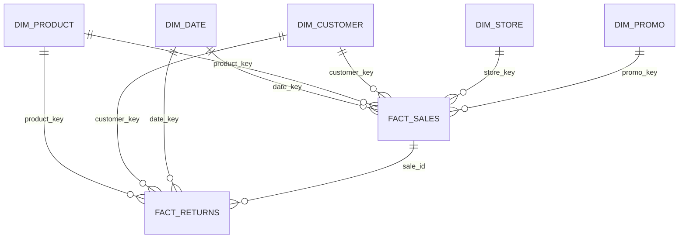
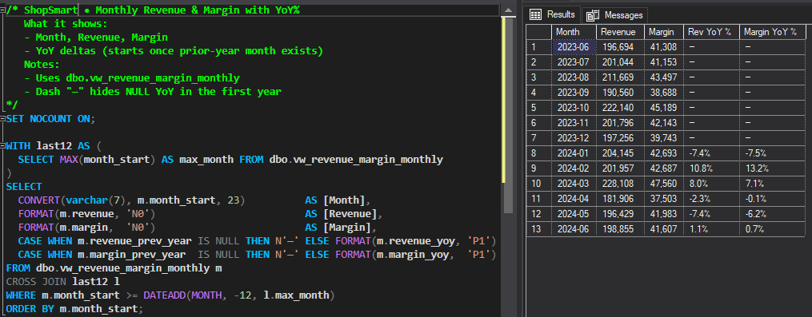
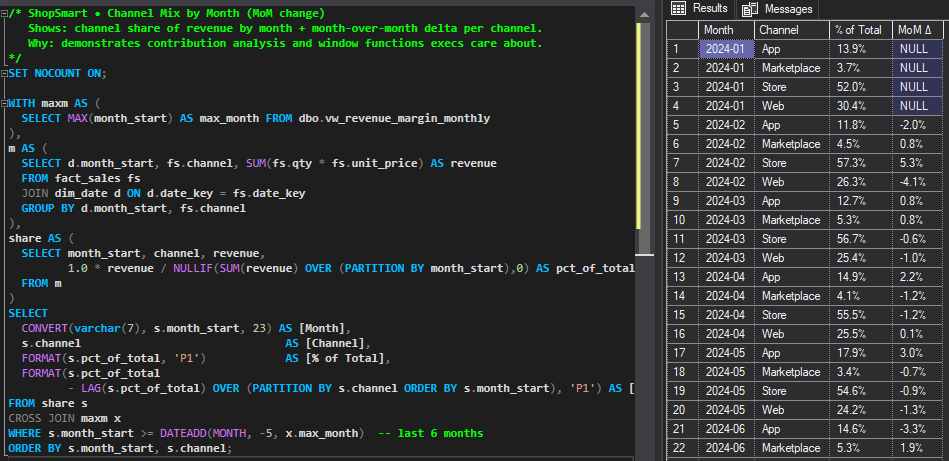
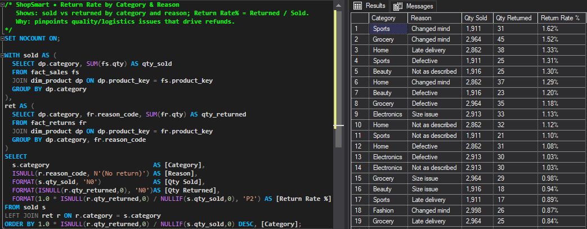
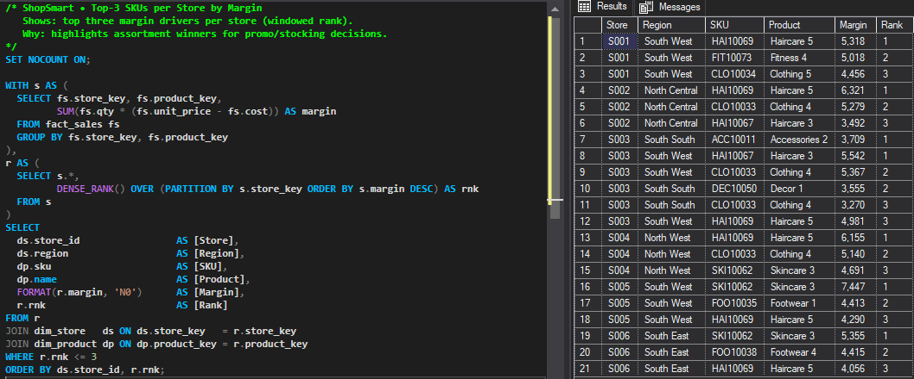
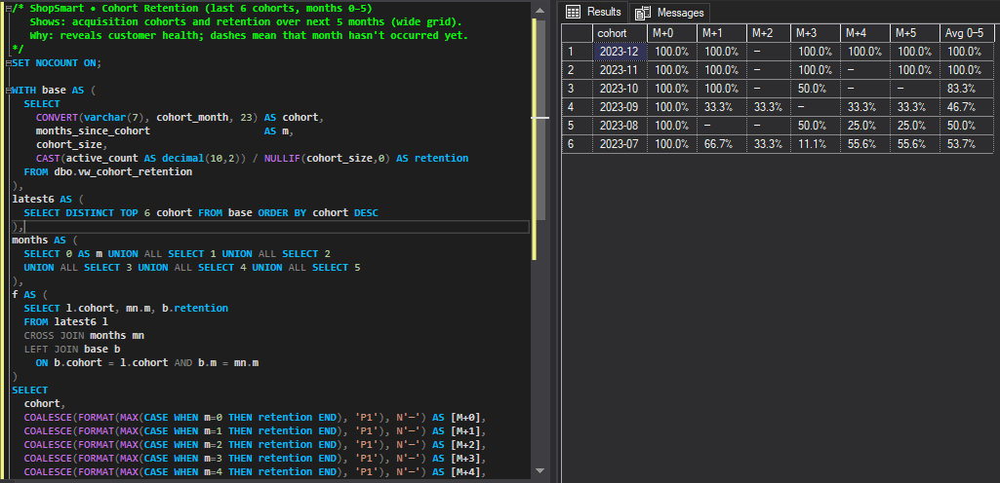

# ShopSmart Retail Warehouse (SQL Server)

Portfolio project in **Microsoft SQL Server**: retail **star schema** + **CSV seed** + executive analytics (YoY revenue & margin, channel mix, return drivers, cohort retention, RFM). Built and tested in **SSMS** with screenshot-ready queries.

---

## Why this matters
- Single source of truth for omni-channel sales & returns
- Answers executive questions on **growth, margin, returns, retention, and winners**
- Reproducible setup with CSV seed data and reusable views

---

## Tech Stack
- SQL Server (T-SQL), SSMS
- Mermaid ERD (renders on GitHub)

---

## ERD

## Screenshots
> Query + grid captured together in SSMS.

- **Monthly Revenue & Margin (YoY)**  
  
- **Channel Mix (MoM Δ)**  
  
- **Return Rate by Category & Reason**  
  
- **Top-3 SKUs per Store by Margin**  
  
- **Cohort Retention (last 6 cohorts)**  
  
